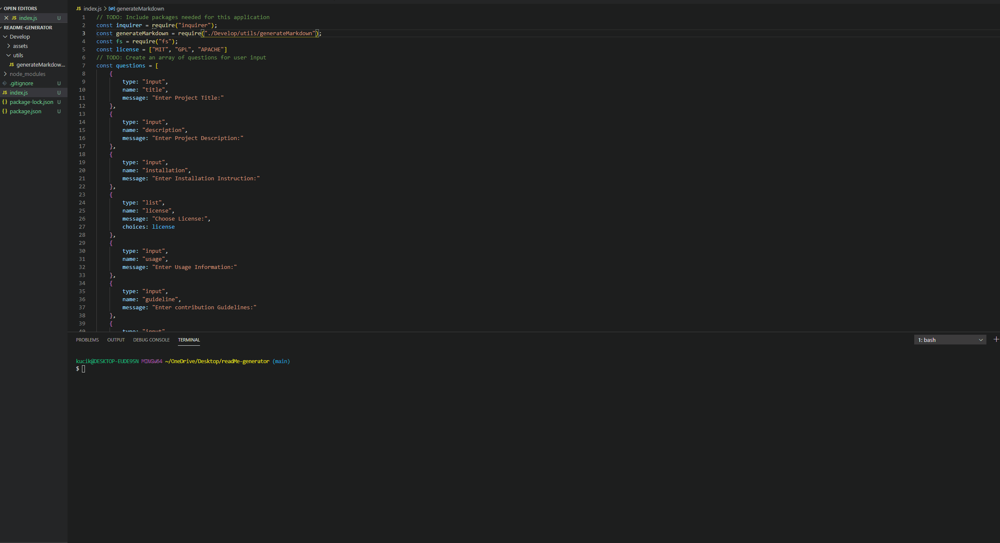

  # Title
  Readme generator
  
  
  
  ## Table of contents 
  - [Description](#description)
  - [Installation](#installation)
  - [Usage Information](#usage-information)
  - [License](#license)
  - [Contribution Guidelines](#contribution-guidelines)
  - [Test Procedure](#test-procedure)
  - [Questions](#questions)
  
  ## Description
     this project aim for generating suitable readme for project

  ## Installation
     clone from this link git@github.com:Andreas3093/readMe-generator.git to local, and enter on terminal "npm i"

  ## Usage Information
     Useful for generating readme

  ## License
     MIT license
  
  ## Contribution Guidelines
     N/A

  ## Test Procedure
     for test, it requires jest dependency

  ## Questions
    if you have questions then please feel free to contact on these addresses,
  Github: [github.com/Andreas3093](https://github.com/github.com/Andreas3093)
  
  Email: [kucikuci87@gmail.com](kucikuci87@gmail.com)
    
  ## Video

   Video: 